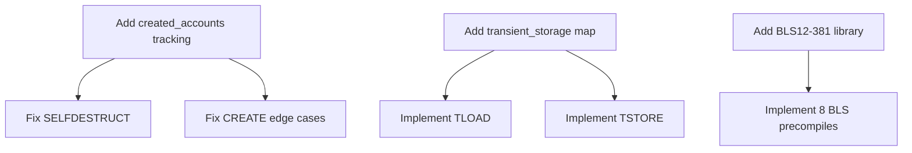

# Agent 17: Test Result Analyzer

## Objective
Analyze test results from the test runner, categorize failures, identify root causes, and prioritize fixes.

## Scope
**Input**: Test runner output from Agent 16
**Output**: Categorized failure analysis and fix priorities

## Dependencies
**Requires**: Agent 16 (test runner working)

## Tasks

### 1. Collect Test Results

**Gather data**:
- [ ] Total test count
- [ ] Pass/fail counts
- [ ] Failed test names
- [ ] Failure messages
- [ ] Category breakdown

**Example input**:
```
[FAIL] stCreate/CreateCollision.json::create_existing_contract
  Expected: address deleted
  Actual: address still exists

[FAIL] stEIP1153/tload_tstore.json::transient_storage_basic
  Error: Unknown opcode 0x5c (TLOAD)

[FAIL] stPrecompiledContracts/bls12_g1add.json::g1_add_basic
  Error: Unknown precompile 0x0b
```

**Action**: Parse test output into structured format.

### 2. Categorize Failures

**Group by root cause**:

**Missing features**:
- Unknown opcodes
- Unimplemented precompiles
- Missing transaction types

**Wrong behavior**:
- State mismatch
- Gas mismatch
- Incorrect output

**Edge cases**:
- Overflow handling
- Boundary conditions
- Error cases

**Example categorization**:
```markdown
## Missing Features (45 failures)
- TLOAD/TSTORE not implemented: 12 tests
- BLS12-381 precompiles missing: 30 tests
- BLOBHASH/BLOBBASEFEE missing: 3 tests

## Wrong Behavior (78 failures)
- SELFDESTRUCT wrong behavior: 23 tests
- CREATE address collision: 15 tests
- SSTORE refund incorrect: 25 tests
- Gas calculation wrong: 15 tests

## Edge Cases (11 failures)
- SDIV overflow: 3 tests
- RETURNDATACOPY bounds: 5 tests
- Memory expansion edge case: 3 tests
```

**Action**: Create comprehensive categorization.

### 3. Impact Analysis

**For each category, assess**:
- [ ] Consensus impact (breaks network compatibility?)
- [ ] Frequency (how common is this operation?)
- [ ] Fix complexity (easy, medium, hard?)
- [ ] Dependencies (blocks other fixes?)

**Priority matrix**:
```
CRITICAL (fix first):
- Breaks consensus
- Common operation
- Relatively easy fix

HIGH (fix soon):
- Breaks consensus
- Less common OR harder fix

MEDIUM (fix eventually):
- Wrong behavior but not consensus-breaking
- OR uncommon operation

LOW (fix if time):
- Edge cases
- Rare scenarios
```

**Action**: Assign priority to each category.

### 4. Root Cause Analysis

**For each major failure category**:

**Example: SELFDESTRUCT failures**
```markdown
### SELFDESTRUCT Wrong Behavior (23 tests)

**Root cause**: Not implementing EIP-6780

**Current behavior**:
- Always deletes account

**Expected behavior** (EIP-6780):
- Only delete if created in same transaction
- Otherwise just send balance

**Fix location**: src/frame.zig:XXXX (SELFDESTRUCT opcode)

**Fix complexity**: MEDIUM
- Need created_accounts tracking in state
- Need to check set in SELFDESTRUCT
- Need to process deletions in finalization

**Dependencies**:
- State management must track created_accounts
- CREATE must add to created_accounts set

**Failing tests**:
1. stSystemOperations/selfdestruct_existing.json
2. stSystemOperations/selfdestruct_created_same_tx.json
[... list all 23]
```

**Action**: Perform root cause analysis for top 10 failure categories.

### 5. Test Coverage Analysis

**Identify gaps**:
- [ ] Which opcodes have no tests passing?
- [ ] Which EIPs have 0% pass rate?
- [ ] Which features have partial implementation?

**Example**:
```markdown
## Coverage by EIP

EIP-1153 (Transient Storage): 0% (0/12)
- TLOAD not implemented
- TSTORE not implemented

EIP-2929 (Access Lists): 45% (23/51)
- Cold costs correct
- Warm costs wrong in some cases
- Pre-warming incomplete

EIP-6780 (SELFDESTRUCT): 0% (0/23)
- Not implemented at all
```

**Action**: Calculate pass rates by feature.

### 6. Fix Dependency Graph

**Identify which fixes enable others**:



**Action**: Create dependency graph for fixes.

### 7. Quick Wins

**Identify easy fixes with high impact**:

**Example**:
```markdown
## Quick Wins

1. **PUSH0** (if missing): 1 line, 12 tests
   - File: src/frame.zig
   - Add: case 0x5F => push(0)
   - Tests: stStackOps/push0_*.json

2. **Gas constants** (if wrong): Update values, 25 tests
   - File: src/primitives/gas_constants.zig
   - Fix: GAS_STORAGE_CLEAR_REFUND = 4800
   - Tests: stSelfBalance/*, stRefund/*

3. **RETURNDATACOPY bounds check**: Add validation, 5 tests
   - File: src/frame.zig
   - Add: if (offset + size > returndata.len) revert()
   - Tests: stReturnDataTest/*
```

**Action**: Identify 5-10 quick wins.

### 8. Blockers

**Identify major blockers**:

**Example**:
```markdown
## Blockers

1. **BLS12-381 missing** (30 tests)
   - Requires crypto library integration
   - Need 8 precompile implementations
   - Complex field arithmetic
   - Estimated effort: 2-3 days

2. **Transient storage missing** (12 tests)
   - Need state management changes
   - Need 2 opcodes
   - Need lifecycle management
   - Estimated effort: 4-6 hours
```

**Action**: List all major blockers with effort estimates.

### 9. Test Result Summary

**Generate summary statistics**:

```markdown
## Test Results Summary

**Overall**: 1089/1234 passing (88.2%)

**By Category**:
- GeneralStateTests: 456/500 (91.2%)
- stPrecompiledContracts: 23/68 (33.8%) ⚠️
- stCreate: 87/105 (82.9%)
- stSystemOperations: 67/90 (74.4%) ⚠️
- stEIP1153: 0/12 (0%) ❌
- stStackOps: 124/125 (99.2%)
- ...

**Critical Missing Features**:
1. BLS12-381 precompiles (0x0b-0x12): 30 tests ❌
2. Transient storage (TLOAD/TSTORE): 12 tests ❌
3. EIP-6780 SELFDESTRUCT: 23 tests ❌

**High Priority Bugs**:
1. SSTORE refund calculation: 25 tests
2. CREATE address collision: 15 tests
3. Access list pre-warming: 18 tests

**Quick Wins**:
1. RETURNDATACOPY bounds: 5 tests
2. Gas constants: 25 tests
3. SAR sign extension: 3 tests
```

**Action**: Generate comprehensive summary.

### 10. Recommended Fix Order

**Prioritized work plan**:

```markdown
## Recommended Fix Order

### Phase 1: Quick Wins (2-3 hours)
1. Fix gas constants (25 tests)
2. Add RETURNDATACOPY bounds check (5 tests)
3. Fix SAR sign extension (3 tests)
**Expected improvement**: +33 tests

### Phase 2: Critical Missing Features (1 day)
4. Implement transient storage (12 tests)
   - Add map to state
   - Implement TLOAD/TSTORE
   - Add clearing logic

5. Fix SELFDESTRUCT EIP-6780 (23 tests)
   - Add created_accounts tracking
   - Update SELFDESTRUCT logic
   - Update finalization

**Expected improvement**: +35 tests

### Phase 3: High-Priority Bugs (1 day)
6. Fix SSTORE refund calculation (25 tests)
7. Fix CREATE address collision (15 tests)
8. Fix access list pre-warming (18 tests)
**Expected improvement**: +58 tests

### Phase 4: Precompiles (2-3 days)
9. Integrate BLS12-381 library (30 tests)
   - Research Zig crypto libraries
   - Implement or bind to Rust
   - Add 8 precompiles
**Expected improvement**: +30 tests

### Phase 5: Remaining Issues
10. Fix remaining edge cases
**Expected improvement**: +20 tests

**Total projected**: 1234/1234 (100%)
```

**Action**: Create detailed fix roadmap.

## Output Format

```markdown
# Agent 17: Test Result Analysis Report

## Executive Summary
- Total tests: X
- Passing: Y (Z%)
- Critical blockers: N
- Recommended fix order: [summary]

## Test Results by Category
[Table with category, total, passing, %, priority]

## Failure Root Causes
### 1. [Category] (N tests)
**Root cause**: [Description]
**Fix location**: [File:line]
**Fix complexity**: [EASY/MEDIUM/HARD]
**Dependencies**: [List]
**Priority**: [CRITICAL/HIGH/MEDIUM/LOW]

[Repeat for top 10 categories]

## Fix Roadmap

### Phase 1: Quick Wins (N tests, X hours)
1. [Fix]
2. [Fix]

### Phase 2: Critical Features (N tests, X hours)
[...]

## Dependency Graph
[Visual or textual dependency graph]

## Test Coverage by EIP
- EIP-XXXX: Y% (passing/total)
[...]

## Files Requiring Changes
1. src/file.zig - [what needs fixing]
[...]

## Estimated Effort
- Total remaining work: X days
- Critical path: [description]
```

## Notes
- Focus on actionable insights
- Prioritize consensus-critical fixes
- Identify quick wins for morale
- Provide clear next steps
- This report feeds into Agent 18 (Fix Validator)
